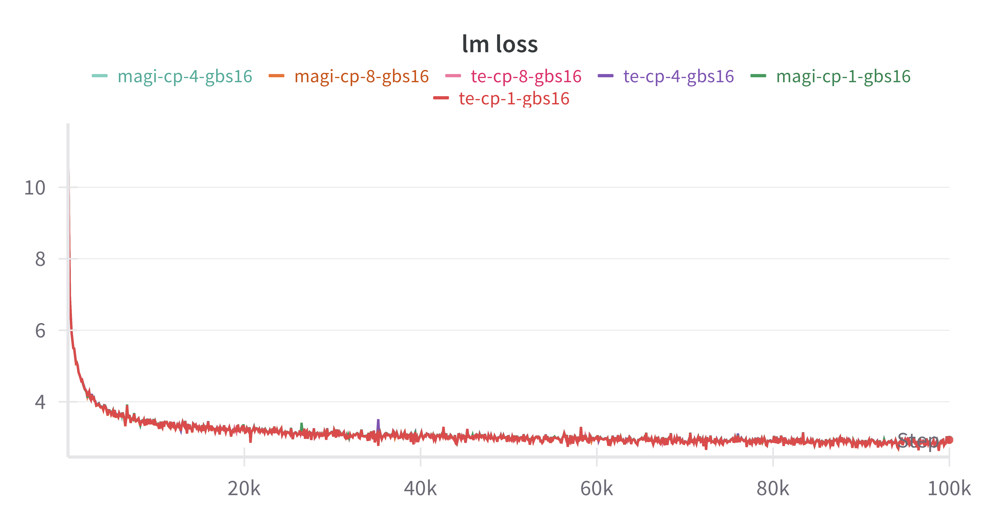

## Intergrate magiattention with megatron
We fork a repo of megatron and show how to intergrate MagiAttention with Megatron.

You can refer to  https://github.com/SandAI-org/Megatron-LM-MagiAttention/pull/1 for more information.

## High-Precision Alignment
We train llama-1b model from scratch with MagiAttention and compare the training loss convergence curve with te context parallel:

You can refer to https://github.com/SandAI-org/Megatron-LM-MagiAttention/pull/1 for more infromation.
