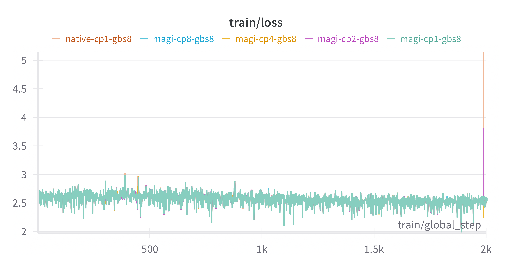

## Intergrate MagiAttention with FSDP

We provide an example in this direcotry to show you how to intergrate MagiAttention with FSDP to train llama-1b model.

What's more, we provide an example in ./experiments to show you how to intergrate MagiAttention with Huggingface Transformers to train a llama-3-1b model.

## High-Precision Alignment

To validate the effectiveness of MagiAttention, we integrated it into the Hugging Face Transformers library and conducted continual training on a Llama-3 1B model in two configurations: one with MagiAttention enabled and one without it as a baseline.

### Training Environment

| **Env**                       | **version**                                                                          |
| ----------------------------- | ------------------------------------------------------------------------------------ |
|  docker             |  ngc25.02-py3                                                                                  |
|  MagiAttention      |  Tags: v1.0.2                                                                                  | 
|  transformers       |  Tags: 4.51.3                                                                                  |
|  accelerate         |  Tags: 1.6.0                                                                                   |

### Training Settings

| **Configuration**             | **Value**                                                                                    |
| ----------------------------- | -------------------------------------------------------------------------------------------- |
| **Dataset**                   | [OpenWebText](https://huggingface.co/datasets/Skylion007/openwebtext)                        |
| **Model**                     | [LLaMA-3-1B](https://huggingface.co/meta-llama/Llama-3.2-1B)                                 |
| **Number of Layers**          | 16                                                                                           |
| **Hidden Size**               | 2048                                                                                         |
| **Number of Attention Heads** | 32                                                                                           |
| **Group Query Attention**     | Enabled                                                                                      |
| **Number of Query Groups**    | 8                                                                                            |
| **Sequence Length**           | 8192                                                                                         |
| **Parallel Size**             | CP1/2/4/8 (MagiAttention) vs no cp(torch native) with a global batch size of 8               |
| **Training Iterations**       | 2000                                                                                         |

### Results

MagiAttention aligns well with torch native training:

